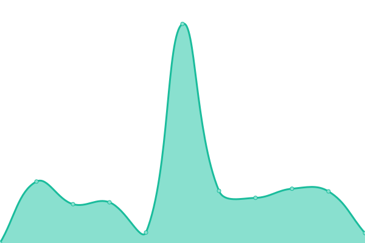
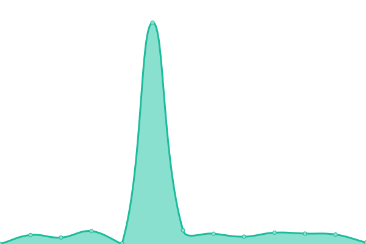
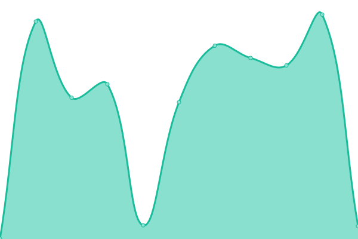
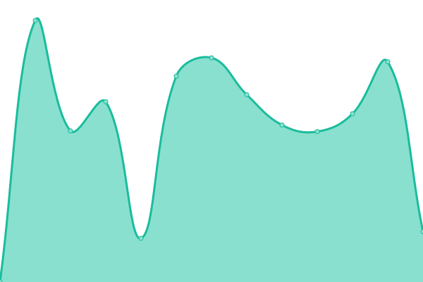
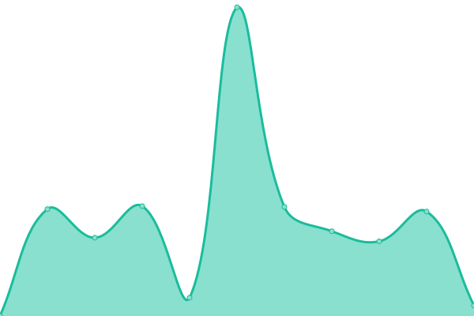
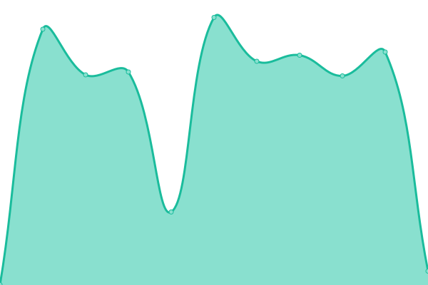

# [📈 Live Status](https://demo.upptime.js.org): <!--live status--> **🟧 Partial outage**

This repository contains the open-source uptime monitor and status page for [ByZocker.de](https://byzocker.de), powered by [Upptime](https://github.com/upptime/upptime).

With [Upptime](https://upptime.js.org), you can get your own unlimited and free uptime monitor and status page, powered entirely by a GitHub repository. We use [Issues](https://github.com/byzocker-de/status.byzocker.de/issues) as incident reports, [Actions](https://github.com/byzocker-de/status.byzocker.de/actions) as uptime monitors, and [Pages](https://demo.upptime.js.org) for the status page.

<!--start: status pages-->
<!-- This summary is generated by Upptime (https://github.com/upptime/upptime) -->
<!-- Do not edit this manually, your changes will be overwritten -->
<!-- prettier-ignore -->
| URL | Status | History | Response Time | Uptime |
| --- | ------ | ------- | ------------- | ------ |
|  [byzocker.de](https://byzocker.de) | 🟩 Up | [byzocker-de.yml](https://github.com/byzocker-de/status.byzocker.de/commits/HEAD/history/byzocker-de.yml) | 

 0ms
     
 | 

<a href="https://status.byzocker.de/history/byzocker-de">100.00%</a>
    

|  Nextcloud | 🟩 Up | [nextcloud.yml](https://github.com/byzocker-de/status.byzocker.de/commits/HEAD/history/nextcloud.yml) | 

 1522ms
     
 | 

<a href="https://status.byzocker.de/history/nextcloud">98.72%</a>
    

|  [shlink](https://l.byzocker.de) | 🟩 Up | [shlink.yml](https://github.com/byzocker-de/status.byzocker.de/commits/HEAD/history/shlink.yml) | 

 2445ms
     
 | 

<a href="https://status.byzocker.de/history/shlink">99.32%</a>
    

|  [PicoShare](https://cdn.byzocker.de) | 🟩 Up | [pico-share.yml](https://github.com/byzocker-de/status.byzocker.de/commits/HEAD/history/pico-share.yml) | 

 496ms
     
 | 

<a href="https://status.byzocker.de/history/pico-share">100.00%</a>
    

|  Jellyfin | 🟩 Up | [jellyfin.yml](https://github.com/byzocker-de/status.byzocker.de/commits/HEAD/history/jellyfin.yml) | 

 0ms
     
 | 

<a href="https://status.byzocker.de/history/jellyfin">100.00%</a>
    

|  Tandoor | 🟥 Down | [tandoor.yml](https://github.com/byzocker-de/status.byzocker.de/commits/HEAD/history/tandoor.yml) | 

 0ms
     
 | 

<a href="https://status.byzocker.de/history/tandoor">100.00%</a>
    

|  Vaultwarden | 🟩 Up | [vaultwarden.yml](https://github.com/byzocker-de/status.byzocker.de/commits/HEAD/history/vaultwarden.yml) | 

 569ms
     
 | 

<a href="https://status.byzocker.de/history/vaultwarden">99.41%</a>
    

<!--end: status pages-->

[**Visit our status website →**](https://demo.upptime.js.org)

## 📄 License

- Powered by: [Upptime](https://github.com/upptime/upptime)
- Code: [MIT](./LICENSE) © [ByZocker.de](https://byzocker.de)
- Data in the `./history` directory: [Open Database License](https://opendatacommons.org/licenses/odbl/1-0/)
